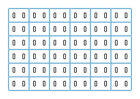
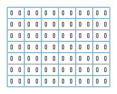

# Choc Bumpers

Little films that sit between your Choc keycap and stem, and give you some cusion and silence on bottom-out. It's the same basic idea as o-rings, just thinner. They've been tested on MBK, LDSA, and CFX keycaps.

These are intended to be laser cut. Personally I use silicone placemats from [Amazon](https://www.amazon.com/dp/B088LKLSTG) (these are about 0.7mm thick) but you could also use thin EVA or Poron foam like is used in switch PCB foams.

I've pre-rendered sets for 30, 36, and 42 keys at both 72 and 96 dpi. If you need to render more, just edit `src/index.js` for what you need and run it with node `$ node src/index.js`. The filenames are auto generated by the number of keys and dpi.

